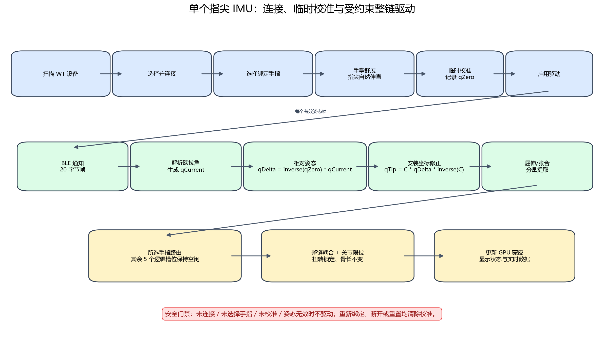

# 单蓝牙 IMU 指尖联动设计

## 1. 背景与目标

本设计把 `Adapter/IMU_Example_Qt` 已验证的 WIT BLE 通信与协议解析能力集成到可活动骨架手模 Demo。用户可以选择一个蓝牙 IMU，将其逻辑绑定到拇指、食指、中指、无名指或小指的指尖指节，通过一次临时零姿态校准，以受约束的工程近似驱动所选手指整条骨骼链。

本版保留 `Palm`、`Thumb`、`Index`、`Middle`、`Ring`、`Little` 六个逻辑姿态槽位，但只允许一个真实设备占用五个手指槽位中的一个。掌心槽位不参与真实设备映射，其他槽位保持无输入，以便未来扩展多设备时不破坏现有类型契约。

## 2. 决策依据

- 归档需求：`../archived/REQ_20260729_单蓝牙IMU指尖联动.md`。
- 已回复问题：`../archived/QL_20260729_单蓝牙IMU指尖联动_已回复.md`。
- 用户决定：IMU 安装在指尖指节，使用临时校准，采用受约束整链耦合，不要求掌心 IMU。
- BLE 参考实现：`../Adapter/IMU_Example_Qt/`，已用 `WT901BLE67` 验证扫描、连接、通知和数据解析。
- 手模基础：`../src/motion/pose_solver.*` 已提供 `applyFingerPose()`；`../src/motion/imu_pose.*` 已提供 twist 分解和六路模拟映射。

## 3. 范围

### 3.1 本次覆盖

- 扫描并选择名称以 `WT` 开头、协议兼容的单个 BLE IMU。
- 连接、断开、服务发现、通知订阅和可诊断错误反馈。
- 实时显示加速度、角速度、欧拉角、帧数、更新时间、电量、温度和版本。
- 从五根手指中选择一个绑定目标。
- 记录临时零姿态并控制驱动启停。
- 把指尖相对零姿态转换为屈伸和张合观测。
- 通过现有耦合系数和关节限位驱动整条手指链。
- 保留手动关节模式和六路 IMU 模拟模式。
- 单元测试、无硬件启动测试和真实设备人工验收路径。

### 3.2 本次不覆盖

- 掌心 IMU、多个真实 IMU 同时连接和设备间时间同步。
- 根据单个指尖 IMU 唯一恢复真实 MCP/PIP/DIP 角度。
- 自动识别 IMU 安装朝向、个体化生物力学标定或医学精度。
- 磁航向漂移补偿、卡尔曼滤波、手掌整体运动消除和自动重连。
- 指尖位置 IK、肌腱模型、受力模型和主工程接入。

## 4. 指尖安装姿态关系

### 4.1 坐标与变量

- `qRaw`：由 WIT 欧拉角生成的传感器姿态四元数。
- `qZeroRaw`：用户点击“临时校准”时保存的 `qRaw`。
- `qDeltaSensor`：传感器相对校准时刻的旋转。
- `qSensorToTip`：传感器安装坐标系到所选指尖解剖坐标系的固定旋转修正。
- `qTipDelta`：指尖解剖坐标系中的相对姿态。
- `flexionDegrees`：从 `qTipDelta` 沿配置屈伸轴提取的有符号角度。
- `abductionDegrees`：移除屈伸 twist 后沿配置张合轴提取的有符号角度。

Qt 中四元数表示从局部坐标到参考坐标的旋转。首版使用：

```text
qRaw         = normalize(QQuaternion::fromEulerAngles(angleX, angleY, angleZ))
qDeltaSensor = normalize(inverse(qZeroRaw) * qRaw)
qTipDelta    = normalize(qSensorToTip * qDeltaSensor * inverse(qSensorToTip))
```

相对化先于安装修正，因此校准时 IMU 可以存在任意绝对朝向；只要设备与指尖之间没有滑动，校准后的零姿态恒为单位旋转。共轭变换把“绕传感器轴的相对旋转”表达为“绕指尖解剖轴的相对旋转”。

### 4.2 为什么指尖观测可以驱动整链

IMU 固定在末端指节，因此它直接观测的是整条链累计旋转后的指尖方向，而不是某一个独立关节角。单个方向观测无法唯一分解到 MCP/PIP/DIP。本 Demo 不做不可辨识的逆解，而采用现有工程约束：

1. 从指尖累计姿态中提取一个归一化屈伸量和一个张合角。
2. 屈伸量按照每个关节的 `coupling` 分配到整条链。
3. 张合只施加到基部关节。
4. 每个关节再次经过自身角度上下限。
5. 扭转轴、平移、缩放和骨长保持锁定。

该映射追求动作连续、结构稳定和演示可解释性，不声称真实关节角重建。

### 4.3 指尖安装修正

`qSensorToTip` 沿用 `config/hand_rig.json` 每根手指的 `sensorCorrection`。首版默认单位四元数，真实佩戴时通过以下动作确认轴向：

1. 手掌舒展、指尖自然伸直，点击临时校准。
2. 只做该手指屈曲，确认模型主要产生正向屈曲。
3. 只做该手指左右张合，确认模型基部产生对应方向运动。
4. 若轴交换或符号错误，只修改该手指的 `sensorCorrection`、`sensorFlexionAxis`、`sensorAbductionAxis` 或角度范围，不修改 BLE 解析器。

首版不提供运行时三轴安装向导，避免把单次人工试验得到的轴向误判为通用硬件标准。

### 4.4 分量提取与约束

沿用 `ImuPoseMapper` 的 swing-twist 思路：先投影屈伸 twist，再从剩余旋转提取张合。屈伸归一化为：

```text
curl = clamp((flexionDegrees - sensorMinDegrees)
             / (sensorMaxDegrees - sensorMinDegrees), 0, 1)
```

张合角直接截断到 `sensorAbductionMinDegrees..sensorAbductionMaxDegrees`。所选手指通过 `PoseSolver::applyFingerPose(bindPose, fingerIndex, curl, abductionDegrees)` 求解。真实单 IMU 模式始终从绑定姿态构造所选手指结果，不累加上一帧角度，避免漂移成为数值积分误差。

## 5. 数据与接口契约

### 5.1 BLE 数据结构

将 Adapter 中以下文件复制到主 Demo 的独立运行时模块，复制后以主 Demo 版本为准，不从 Adapter 目录跨目标链接：

- `src/imu/imu_data.h`
- `src/imu/wit_protocol_parser.h/.cpp`
- `src/imu/wit_ble_manager.h/.cpp`

`ImuData` 保留原字段和 `Q_DECLARE_METATYPE`。`WitBleManager` 保留扫描、连接、断开、状态和原始通知信号。`WitProtocolParser` 保留 20 字节流解析，并通过 `dataUpdated(const ImuData &)` 输出完整快照。

### 5.2 单设备姿态控制器

新增不依赖 Widgets/OpenGL 的 `SingleImuFingerController`：

```cpp
enum class SingleImuDriveState {
    Disconnected,
    ConnectedUnbound,
    BoundUncalibrated,
    Ready,
    Driving,
    Error
};

struct SingleImuMappingOutput {
    PoseResult pose;
    SingleImuDriveState state{SingleImuDriveState::Disconnected};
    int fingerIndex{-1};
    float flexionDegrees{0.0F};
    float abductionDegrees{0.0F};
    float curl{0.0F};
    bool frameApplied{false};
    QVector<PoseInputError> errors;
};

class SingleImuFingerController {
public:
    explicit SingleImuFingerController(const PoseSolver &solver);
    void setConnected(bool connected);
    void bindFinger(int fingerIndex);
    bool calibrate(const QQuaternion &rawOrientation, qint64 timestampUsec);
    void setDriving(bool enabled);
    SingleImuMappingOutput update(const QQuaternion &rawOrientation,
                                  qint64 timestampUsec);
    void resetCalibration();
    SingleImuDriveState state() const;
};
```

行为契约：

- `setConnected(false)` 清除绑定、校准、驱动和时间戳，输出绑定姿态。
- 切换绑定手指清除校准并停止驱动，防止把上一手指安装关系复用到新手指。
- `calibrate()` 仅接受已连接、已绑定、有限且可归一化的四元数；成功后保存 `qZeroRaw`，重置模型为绑定姿态。
- `setDriving(true)` 只在 `Ready` 状态成功；其他状态保持不变并返回可诊断错误。
- `update()` 在 `Driving` 状态且时间戳单调时应用姿态；无效或倒退帧保持上一有效输出，不产生 NaN。
- 重新校准、断开、换手指和点击“重置姿态”都会停止驱动。

### 5.3 六槽位兼容

`ImuSlot` 和 `HandImuFrame` 不删除。真实单设备控制器根据 `fingerIndex` 映射到对应 `Thumb..Little` 逻辑槽位，用于状态显示和未来数据总线扩展；本版不伪造 `Palm` 样本，也不把单设备帧送入当前要求掌心有效的 `ImuPoseMapper::update()`。

## 6. 交互流程与状态门禁

如图 Fig001 所示，用户先完成 BLE 连接和手指绑定，再在自然舒展姿态下临时校准，最后显式启用驱动。有效姿态帧经过相对化、安装修正和约束求解后更新模型。



*图 Fig001：单个指尖 IMU 的连接、临时校准和受约束整链驱动流程。红色门禁用于阻止未完成前置条件的数据驱动模型。生成脚本：`../scripts/generate_single_imu_flow.py`。*

### 6.1 操作顺序

1. 在模式列表选择“真实单 IMU”。
2. 点击“扫描”，列表只显示名称以 `WT` 开头的兼容候选设备。
3. 选择设备并点击“连接”，等待状态变为“设备已连接”。
4. 从下拉框选择绑定手指。
5. 将手掌舒展朝上、目标手指自然伸直，保持 IMU 与指尖固定。
6. 在收到至少一个有效姿态帧后点击“临时校准”。
7. 点击“启用驱动”，活动目标手指并观察模型与实时数据。
8. 安装滑动、姿态方向不符或基准变化时，停止驱动后重新校准。
9. 结束时点击“断开”。

### 6.2 UI 布局

主窗口模式列表增加“真实单 IMU”。该模式面板包含：

- 设备区：扫描按钮、设备下拉框、连接/断开按钮、连接状态。
- 绑定区：手指下拉框、当前逻辑槽位、临时校准按钮、启用驱动开关。
- 实时数据区：加速度、角速度、欧拉角、帧数、更新时间、电量、温度和版本。
- 映射诊断区：当前屈伸角、张合角、归一化 `curl`、是否触发限位、最近错误。
- 风险提示：“单指尖 IMU 整链耦合为工程近似；校准后请保持掌心参考方向；不是医学关节角。”

### 6.3 控件启用规则

| 控件 | 启用条件 |
|---|---|
| 扫描 | 未处于连接/断开过渡状态 |
| 连接 | 已选择设备且当前未连接 |
| 手指选择 | 已连接且未驱动 |
| 临时校准 | 已连接、已选择手指、已收到有效姿态帧且未驱动 |
| 启用驱动 | 校准成功 |
| 断开 | 正在连接或已连接 |

## 7. 模块与构建改动

- 根研究 CMake 增加 Qt `Bluetooth` 组件。
- 新增 `handdemo_imu` 静态库，包含 BLE 管理器、协议解析器和 `ImuData`。
- `handdemo_motion` 新增单设备控制器，但不得依赖 Qt Bluetooth。
- `hand_rig_demo` 链接 `handdemo_imu`、`handdemo_motion` 和 `Qt6::Bluetooth`。
- UI 负责信号槽装配与状态展示，不在槽函数中实现四元数分解公式。
- Adapter 继续作为只读参考和独立历史产物，不删除、不反向修改。

## 8. 错误与恢复

- 扫描权限或适配器错误：状态进入 `Error`，保留窗口，允许重新扫描。
- 服务或特征不兼容：断开设备并显示缺少的 UUID。
- BLE 断开：立即停止驱动、清除校准和绑定，模型回到绑定姿态。
- 姿态非有限、零模或时间戳倒退：丢弃该帧，保持上一有效姿态并显示错误。
- 设备长时间无新姿态帧：超过 500 ms 标记“数据超时”并暂停驱动；恢复数据后要求重新校准，避免跳变。
- 换手指：停止驱动并清除校准，必须针对新的指尖安装关系重新校准。
- Windows 快速重连失败：不自动循环连接，提示等待数秒后重试。

## 9. 测试设计

### 9.1 自动测试

- 协议：保留 Adapter 中分包、粘包、噪声、正负角度、寄存器解析测试。
- 欧拉转换：零角、单轴正负角和有限性。
- 校准：任意绝对姿态在校准后首帧输出单位相对旋转和绑定姿态。
- 指尖安装修正：已知轴交换四元数能把传感器轴映射到目标屈伸轴。
- 手指路由：五个手指逐一绑定时只修改对应链，其他链保持绑定姿态。
- 状态机：未连接、未绑定、未校准不能驱动；换手指、断开和重置清除校准。
- 约束：超范围输入被截断，扭转不驱动，骨长不变，无 NaN。
- 异常：零模、非有限、时间戳倒退和超时均不破坏上一有效姿态。

### 9.2 启动与硬件测试

- 无硬件 smoke：进入真实单 IMU 模式，验证控件初始门禁；再执行原手模 smoke，确保旧模式回归。
- 真实设备：使用 `WT901BLE67` 或兼容设备完成扫描、连接、数据更新、五指中至少一指绑定、校准、屈伸、张合、重新校准和断开。
- 人工观察必须记录 IMU 实际绑在哪根手指、传感器朝向、校准姿态、动作方向和是否调整 `sensorCorrection`。

## 10. 可复现说明

流程图生成命令：

```powershell
python scripts/generate_single_imu_flow.py
```

依赖 Python 3、Matplotlib 和系统中文字体。脚本固定输出到 `figures/Fig001_单IMU交互与姿态流程.png`。

开发完成后的预期验证命令：

```powershell
cmake -S . -B build -DBUILD_TESTING=ON -DCMAKE_PREFIX_PATH="D:/Devtools/Qt/6.8.3/msvc2022_64"
cmake --build build --config Debug -j8
ctest --test-dir build -C Debug --output-on-failure
./build/bin/Debug/hand_rig_demo.exe --smoke-test
```

## 11. 限制与后续演进

- 临时零姿态只能消除校准时刻的绝对朝向，不能消除校准后手掌整体转动。
- IMU 在指尖上的滑动会直接改变安装修正关系，必须重新校准。
- WIT 欧拉角轴序依赖设备输出约定，首版通过集中安装修正和真实设备测试验证。
- 若未来增加掌心 IMU，应将 `qDeltaSensor` 的固定零参考替换为掌心动态参考，但保留指尖安装修正和整链约束。
- 若未来要求真实关节角，需要更多传感器、受约束 IK 或个体化运动模型，不能仅扩大单 IMU 的角度范围替代。
